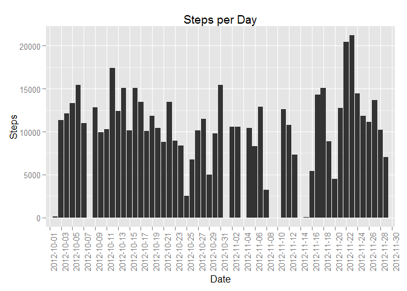
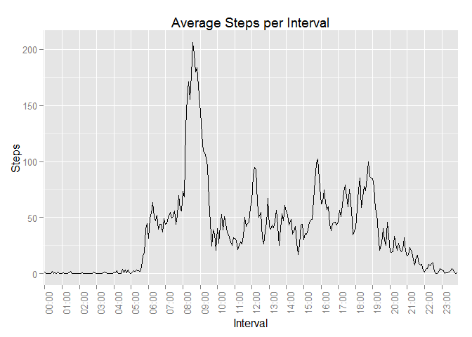
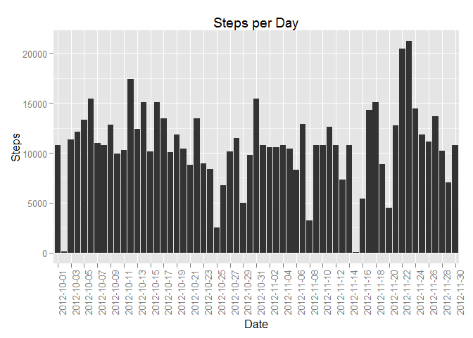
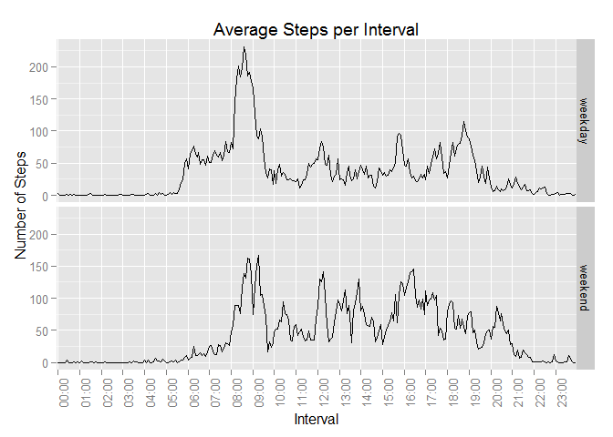

# Reproducible Research: Peer Assessment 1


## Loading and preprocessing the data


```r
setwd("C:/DataScience/WorkDir/ReproducibleResearch")
require(data.table)
```

```
## Loading required package: data.table
```

```r
require(dplyr)
```

```
## Loading required package: dplyr
## 
## Attaching package: 'dplyr'
## 
## The following objects are masked from 'package:data.table':
## 
##     between, last
## 
## The following object is masked from 'package:stats':
## 
##     filter
## 
## The following objects are masked from 'package:base':
## 
##     intersect, setdiff, setequal, union
```

```r
require(ggplot2)
```

```
## Loading required package: ggplot2
```

```r
require(stringr)
```

```
## Loading required package: stringr
```

```r
df_stepsData <- read.csv("./data/activity.csv")
```


## What is mean total number of steps taken per day?


```r
df_stepsPerDay <-  df_stepsData %>% group_by(date) %>%
  summarise(stepsPerDay = sum(steps,na.rm = TRUE))                 
stepsSummary <- summarise(df_stepsPerDay, stepsMean = mean(stepsPerDay,na.rm=TRUE), 
          stepsMedian = median(stepsPerDay,na.rm = TRUE))
#
# Plot Steps per Day
#
xlabels <- df_stepsPerDay$date[seq(1,length(df_stepsPerDay$date),2)]
# 
ggplot(df_stepsPerDay, aes(x = factor(date), y = stepsPerDay)) + 
      geom_histogram(stat = "identity") +  
      labs(title = "Steps per Day", x = "Date", y = "Steps") +
      theme(axis.text.x = element_text(angle = 90, hjust = 1)) +
      scale_x_discrete(breaks=xlabels, labels=xlabels)
```

 
# 

* Summary of total number of steps taken per day -
 Mean:   9354
 Median: 10395
 
 
## What is the average daily activity pattern?


```r
df_dailyPattern <-  df_stepsData %>% group_by(interval) %>%
  summarise(avgStepsPerInterval = mean(steps,na.rm = TRUE)) 
#
# use hh:mm format for the interval with max steps (maxint)
#
maxint <- tail(arrange(df_dailyPattern,avgStepsPerInterval),1)$interval
maxint <- paste0(str_sub(str_pad(as.character(maxint),4, pad = "0"),1,2), ":",
  str_sub(str_pad(as.character(maxint),4, pad = "0"),3,4))
#
# create a character variable 'time_char' with hh:mm format for interval
#
df_dailyPattern$time_char <- 
  paste0(str_sub(str_pad(as.character(df_dailyPattern$interval),4, pad = "0"),1,2),
         
  ":",
  str_sub(str_pad(as.character(df_dailyPattern$interval),4, pad = "0"),3,4))
#
# select every 12th label on x-axis to avoid clutter
#
xlabels <- df_dailyPattern$time_char[seq(1,length(df_dailyPattern$interval),12)]
#
ggplot(df_dailyPattern, aes(x = time_char, y = avgStepsPerInterval, group=1)) + 
  geom_line() +  
  labs(title = "Average Steps per Interval", x = "Interval", y = "Steps") +
  theme(axis.text.x = element_text(angle = 90, hjust = 1)) +
  scale_x_discrete(breaks=xlabels, labels=xlabels)  
```

 

* on average across all the days in the dataset, 08:35 interval contains the maximum number of steps  

## Imputing missing values


```r
## Calculate and report the total number of missing values in the dataset 
## (i.e. the total number of rows with NAs)
stepsNA <- filter(df_stepsData,is.na(steps))
```

* Total number of missing values is 2304


```r
#
# Convert daily averages to data.table
#
dt_dailyPattern <- data.table(df_dailyPattern)
setkey(dt_dailyPattern,interval) 
#
# define function to retun avearge steps for required interval
#
getAvg <- function(i) {dt_dailyPattern[interval == i,avgStepsPerInterval]}
#
# Replace mssing values:
# create a new column with NA values is steps replaced by average for the interval
#
df_stepsDataA <- 
  mutate(df_stepsData, steps = 
    ifelse(is.na(steps), getAvg(interval), steps))
#
# Create new dataset with missing values replaced
#
write.csv(df_stepsDataA ,"activity_updated.csv")
#
# Make a histogram of the total number of steps taken each day 
#
df_stepsPerDayA <-  df_stepsDataA %>% group_by(date) %>%
  summarise(stepsPerDay = sum(steps,na.rm = TRUE))                 
stepsSummaryA <- 
  summarise(df_stepsPerDayA, stepsMean = mean(stepsPerDay,na.rm=TRUE),
                             stepsMedian = median(stepsPerDay,na.rm = TRUE))
stepsMeanI   <- as.integer(stepsSummaryA$stepsMean)
stepsMedianI <- as.integer(stepsSummaryA$stepsMedian)
                  #
# Plot Steps per Day
#
#
# select every alternate label on x-axis to avoid clutter
#
xlabels <- df_stepsPerDayA$date[seq(1,length(df_stepsPerDay$date),2)]
# 
ggplot(df_stepsPerDayA, aes(x = factor(date), y = stepsPerDay)) + 
  geom_histogram(stat = "identity") +  
  labs(title = "Steps per Day", x = "Date", y = "Steps") +
  theme(axis.text.x = element_text(angle = 90, hjust = 1)) +
  scale_x_discrete(breaks=xlabels, labels=xlabels)
```

 

```r
#
```
#

* Summary of total number of steps taken per day -
 Mean:   10766
 Median: 10766

* Before replacing NAs, these values were -
 Mean:   9354
 Median: 10395


## Are there differences in activity patterns between weekdays and weekends?


```r
df_stepsDataA$day   <- weekdays(as.Date(df_stepsDataA$date)) 
df_stepsDataA$wkday <- ifelse((df_stepsDataA$day == "Saturday" |
                                 df_stepsDataA$day == "Sunday"),"weekend", "weekday")
df_stepsDataA$wkday <- as.factor(df_stepsDataA$wkday)

df_dailyPatternA <-  df_stepsDataA %>% group_by(wkday, interval) %>%
  summarise(avgStepsPerInterval = mean(steps)) 

df_dailyPatternA$time_char <- 
  paste0(str_sub(str_pad(as.character(df_dailyPattern$interval),4, pad = "0"),1,2),
         ":",
         str_sub(str_pad(as.character(df_dailyPattern$interval),4, pad = "0"),3,4))
#
# Plot Steps per Day in two groups weekday & weekend
# select every 12th label on x-axis to avoid clutter
#
xlabels <- df_dailyPatternA$time_char[seq(1,length(df_dailyPattern$interval),12)]
ggplot(df_dailyPatternA, aes(x = time_char, y = avgStepsPerInterval, group=1)) + 
  geom_line() +  
  facet_grid(wkday ~ .) +
  labs(title = "Average Steps per Interval", x = "Interval", y = "Number of Steps") +
  theme(axis.text.x = element_text(angle = 90, hjust = 1)) +
  scale_x_discrete(breaks=xlabels, labels=xlabels)  
```

 
